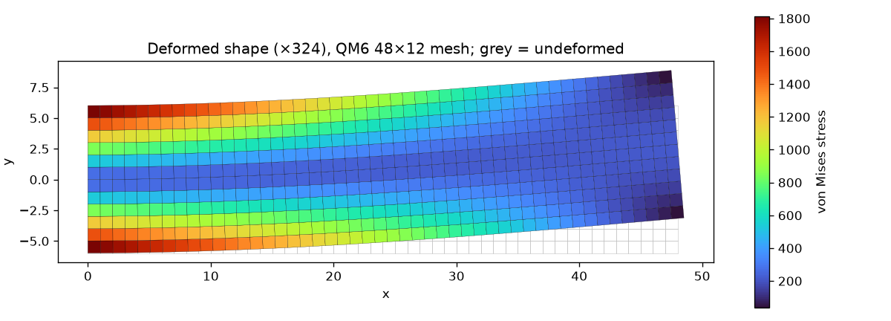
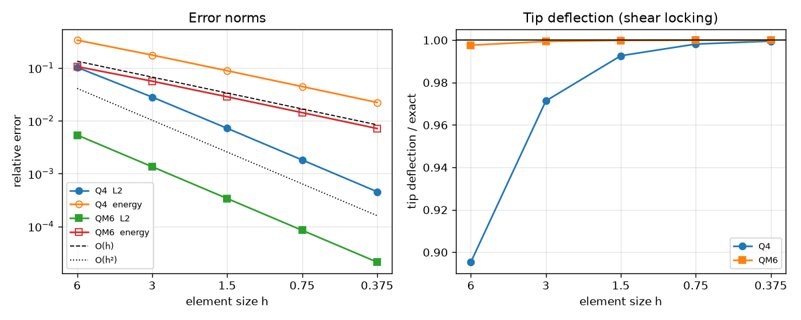

# FEM Cantilever: Plane-Stress Linear Elasticity

[](https://github.com/cfdgasman/fem-cantilever/actions/workflows/ci.yml)

A compact 2D finite element code for plane-stress linear elasticity. It is verified against the **exact Timoshenko & Goodier solution** for a cantilever under an end shear load. The code compares standard bilinear **Q4** elements with Q4 plus **incompatible modes (QM6)**, and shows **shear locking** and how incompatible modes remove it.

<p align="center"></p>

## Problem

Cantilever L = 48, D = 12, unit thickness, E = 3×10⁷, ν = 0.3, end load P = 1000 (the classic benchmark).

The exact elasticity solution is imposed as boundary data:
- the **exact displacements** at the clamped end x = 0
- the **exact parabolic shear traction** τ<sub>xy</sub> = P/(2I)(D²/4 − y²) at the free end x = L

So the finite element error can be measured against a known solution everywhere in the domain. Exact tip deflection:

$$ u_y(L,0) = \frac{PL^3}{3EI} + \frac{(4+5\nu)PD^2L}{24EI} = 8.900\times10^{-3} $$

## Method

| | |
|---|---|
| Elements | Bilinear Q4, 2×2 Gauss (full integration) |
| Incompatible modes | Wilson/Taylor bubbles (1 − ξ²), (1 − η²) for u and v, **statically condensed** per element; internal amplitudes recovered for stresses |
| Assembly | Vectorised sparse COO; every element of the uniform mesh shares one K<sub>e</sub> |
| Loads | Consistent nodal forces from 2-point Gauss on each loaded edge |
| Error norms | Relative L2 displacement and energy norms by 3×3 Gauss quadrature |

## Results

### Convergence and shear locking

<p align="center"></p>

| Mesh | Q4 tip / exact | QM6 tip / exact | Q4 L2 err | QM6 L2 err | Q4 energy err | QM6 energy err |
|---|---|---|---|---|---|---|
| 8×2 | 0.8954 | 0.99764 | 1.03e-01 | 5.37e-03 | 3.36e-01 | 1.06e-01 |
| 16×4 | 0.9713 | 0.99940 | 2.81e-02 | 1.35e-03 | 1.75e-01 | 5.62e-02 |
| 32×8 | 0.9927 | 0.99985 | 7.21e-03 | 3.39e-04 | 8.87e-02 | 2.85e-02 |
| 64×16 | 0.9982 | 0.99996 | 1.82e-03 | 8.47e-05 | 4.45e-02 | 1.43e-02 |
| 128×32 | 0.9995 | 0.99999 | 4.55e-04 | 2.12e-05 | 2.23e-02 | 7.14e-03 |

**Observed orders** (three finest meshes): L2 = **1.99 / 2.00**, energy = **1.00 / 1.00** for Q4 / QM6. These are exactly the optimal rates for bilinear elements, O(h²) and O(h).

**Shear locking.** In bending, the Q4 displacement field cannot represent pure curvature without producing spurious shear strain, so coarse meshes are far too stiff. With only 2 elements through the depth, Q4 gets **89.5 %** of the tip deflection, while **QM6 gets 99.8 %** on the same mesh. QM6 also reduces the L2 error about 20× at every resolution.

### Checks in the test suite
- Rigid-body modes: each element stiffness has exactly 3 zero eigenvalues
- Patch test: constant strain states are reproduced (Q4 and QM6)
- The exact solution satisfies Hooke's law (checked numerically)
- Q4 converges at second order in L2
- QM6 removes shear locking on an 8×2 mesh

## Usage

```bash
pip install -r requirements.txt
python run.py      # convergence table + figures in docs/
pytest
```

## Reference

S. P. Timoshenko, J. N. Goodier, *Theory of Elasticity*, 3rd ed., McGraw-Hill, 1970, §21.
R. L. Taylor, P. J. Beresford, E. L. Wilson, *A non-conforming element for stress analysis*, IJNME 10 (1976) 1211–1219.

## License

MIT
